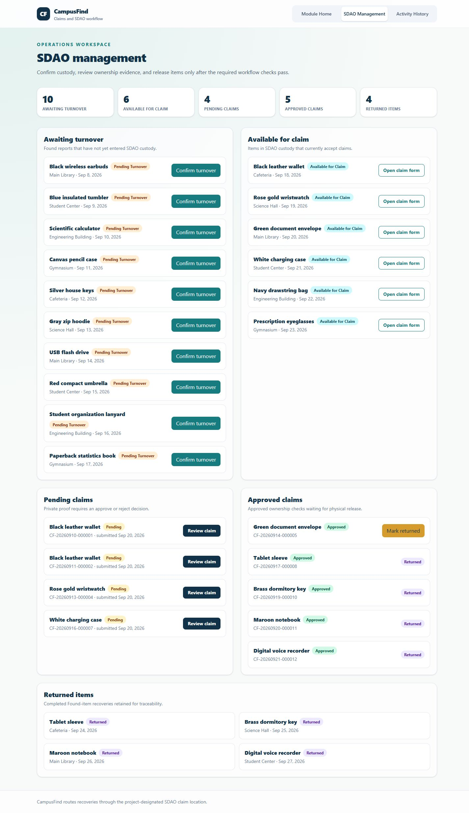
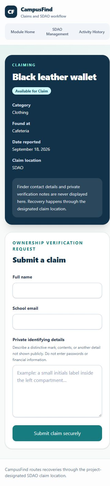

# CampusFind Client

CampusFind is a campus lost-and-found and claim management application. This repository contains the React, TypeScript, Tailwind CSS, React Router, React Hook Form, Zod, and Axios frontend. The implemented Member 3 module covers claim submission, SDAO management, private claim review, and activity history.

## Member 3 contribution

- Privacy-conscious claim form for eligible Found items
- SDAO queues for Awaiting Turnover, Available for Claim, Pending Claims, Approved Claims, and Returned Items
- Approve/reject review form with validation and confirmation
- Turnover and return confirmation workflows
- Filterable activity history
- One configured Axios client and a reusable data-loading hook
- Loading, error, empty, validation, success, and not-found states
- Responsive design verified at 375px and desktop widths

## Screenshots

### SDAO desktop workflow



### Claim form at 375px



## Routes

| Route | Page | Purpose |
|---|---|---|
| `/` | Member 3 module home | Explains the claim, SDAO, and traceability module |
| `/items/:id/claim` | Submit Claim | Loads eligibility and submits private ownership evidence |
| `/sdao` | SDAO Management | Shows grouped workflow queues and operational actions |
| `/sdao/claims/:id` | Claim Review | Displays private claim evidence and records a decision |
| `/activity` | Activity History | Shows and filters important workflow events |
| `*` | Not Found | Provides a usable 404 state |

## Setup

Requirements: Node.js 20 or newer and the CampusFind API running locally.

```bash
npm install
copy .env.example .env
npm run dev
```

Configure `.env` when the API is not at the default address:

```env
VITE_API_BASE_URL=http://localhost:8000/api
```

Production verification:

```bash
npm run lint
npm run build
```

## Frontend data flow

1. A routed page calls the shared Axios instance in `src/api/client.ts`.
2. Read screens use `useApiResource` for loading, cancellation, error handling, and reloads.
3. Forms validate with schemas defined outside the component using Zod and `z.infer` types.
4. The Express API enforces workflow rules and returns a consistent `{ data, message }` or `{ message, details? }` shape.
5. A successful mutation reloads the affected server-backed view instead of duplicating server data in React state.

## Privacy decisions

Public claim pages show item-identification information only. They do not expose finder contact details, claimant emails, private proof, or internal review notes. Claimant evidence is displayed only in the SDAO review interface. Authentication is outside the required MVP, so this is a workflow boundary rather than production-grade access control.

## Known limitations

- Production authentication and role-based authorization are out of MVP scope.
- Images and file uploads are not included.
- Notifications, direct student-to-student contact, and deployment are not included.
- This repository implements Member 3 routes; the remaining landing, discovery, item CRUD, matching, and analytics pages belong to the other team modules.

## QA and defense

See [Member 3 QA and Defense Guide](docs/MEMBER_3_QA_AND_DEFENSE.md) for the verified test matrix, demo steps, data flow, failure cases, and likely defense questions.

For the complete project purpose, architecture, data model, workflows, business-rule rationale, API contracts, setup, QA evidence, integration contracts, and defense explanation, see [CampusFind Complete Project Documentation](docs/CAMPUSFIND_COMPLETE_DOCUMENTATION.md).
