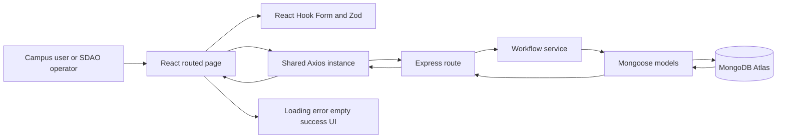
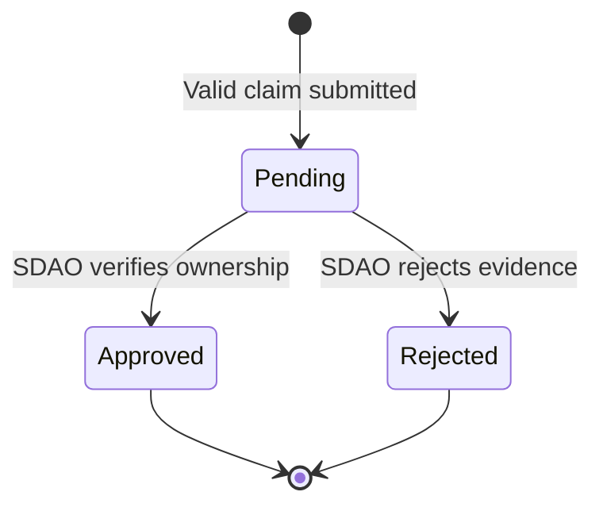
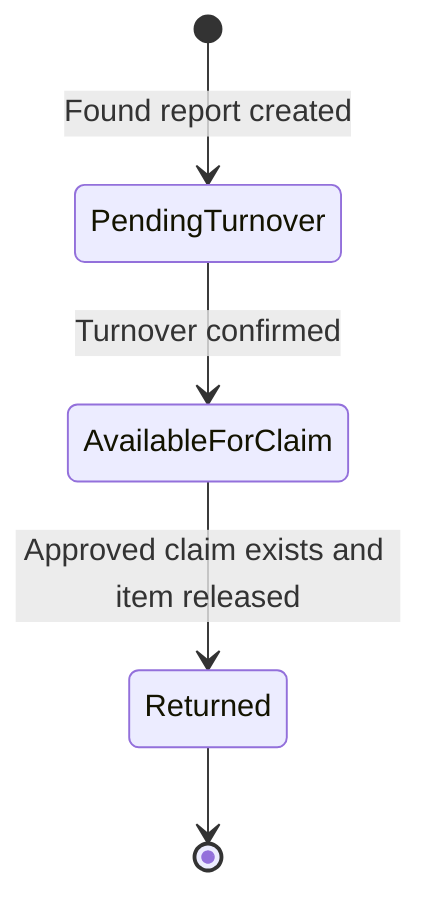

# CampusFind Complete Project Documentation

## Document purpose

This document explains what CampusFind is, why it exists, how the planned full-stack system is organized, and exactly what was implemented for Member 3. It is intended for development handoff, final submission, demonstration, and oral defense.

The current repositories are divided into:

- `campusfind-client`: React, TypeScript, Tailwind CSS, React Router, React Hook Form, Zod, and Axios.
- `campusfind-server`: Node.js, Express, Mongoose, and MongoDB Atlas.

The project requirements came from the CTADWEBL final-project rubric, the CampusFind blueprint, and the team task-allocation plan. The implemented work follows the assigned Member 3 scope: Claims, SDAO Workflow, and Activity Logs, plus shared QA, README, seed verification, documentation, screenshots, and defense preparation.

## 1. Project identity

### Project title

CampusFind - Campus Lost and Found and Claim Management System

### Project goal

CampusFind centralizes campus Lost and Found reports and provides a safer recovery process through a project-designated SDAO claim location. It is designed to do more than store records. It evaluates eligibility, enforces status transitions, groups records into operational queues, closes competing claims, generates unique references, and records an activity trail.

### Problem being addressed

Traditional lost-and-found processes are often fragmented. Reports may be posted in unrelated channels, ownership claims may not be documented consistently, and direct finder-to-claimant communication can expose personal information. CampusFind provides one workflow with clear states and traceable decisions.

### Intended users

- Students and campus users who report Lost or Found items.
- Claimants who submit private identifying details for an eligible Found item.
- SDAO staff or project-designated operators who confirm turnover, review claims, and release approved items.
- Project evaluators who need to see genuine data processing, validation, persistence, and error handling.

## 2. Scope and team ownership

CampusFind was divided into three meaningful full-stack areas.

| Member | Primary ownership | Examples |
|---|---|---|
| Member 1 | Discovery and analytics | Landing, dashboard, browsing, search, filtering, sorting, matching, statistics |
| Member 2 | Item reporting and management | Report and edit forms, item CRUD, category/location management, item lifecycle rules |
| Member 3 | Claims, SDAO, and activity | Claim form, claim review, SDAO queues, turnover, approval/rejection, return, activity logs |
| Shared | Integration and quality | Responsive QA, README, seed verification, screenshots, documentation, defense preparation |

### Member 3 boundary

Member 3 did not implement the other members' discovery pages, match-scoring interface, statistics dashboard, main item CRUD screens, or category/location management screens. The Member 3 work includes only the minimum shared contracts needed for the assigned workflow to run, such as the Item model contract, router mounting, consistent errors, Axios configuration, navigation, and shared UI states.

## 3. System architecture



### Why this architecture was used

- React components keep the interface modular and reusable.
- React Router gives the project distinct pages and dynamic routes.
- React Hook Form avoids unnecessary form-state re-renders.
- Zod provides one explicit client-side validation schema and inferred TypeScript types.
- A single Axios instance keeps the API base URL and request configuration consistent.
- Express routers prevent `app.js` from becoming a monolithic route file.
- Workflow services keep business rules out of routing and UI code.
- Mongoose enforces database structure and validation.
- MongoDB transactions keep multi-document status changes atomic.
- Activity logs make important workflow operations explainable and traceable.

## 4. Main CampusFind workflows

### Lost-item flow

This flow is owned primarily by the discovery and item modules.

1. A user creates a Lost report.
2. The report begins with `Open` status.
3. CampusFind compares it with active Found reports.
4. The interface may display possible matches.
5. A successful recovery changes the Lost item to `Recovered`.
6. Recovered reports leave active matching.

### Found-item flow

1. A finder creates a Found report.
2. The report begins with `Pending Turnover` status.
3. SDAO physically receives the item.
4. An operator confirms turnover.
5. The status changes to `Available for Claim`.
6. Claimants may submit ownership claims.
7. SDAO reviews private identifying details.
8. One claim may be approved.
9. The approved item can be physically released and marked `Returned`.

### Claim flow



1. The client requests claim eligibility for a selected item.
2. The server verifies that the item is Found and `Available for Claim`.
3. The user provides a name, school email, and private identifying details.
4. Zod validates the client form.
5. Mongoose validates the server document again.
6. The server creates a unique human-readable reference code.
7. The claim begins as `Pending`.
8. SDAO may approve or reject it.
9. Approval automatically rejects other Pending claims for the same item.
10. Finalized claims cannot be changed through the current workflow.

### SDAO item-status flow



## 5. Data model

### Item

The Item schema is a minimum shared contract needed by the claim workflow. Member 2 may extend the item module while preserving these fields and status rules.

| Field | Type | Purpose and rule |
|---|---|---|
| `title` | String | Required public item name, 3-120 characters |
| `description` | String | Required non-sensitive identifying description |
| `category` | ObjectId | Required reference to Category |
| `location` | ObjectId | Required reference to Location |
| `type` | Enum | `Lost` or `Found` |
| `dateOccurred` | Date | Required and cannot be in the future |
| `status` | Enum | Must belong to the lifecycle for the selected type |
| `claimLocation` | String | Project-designated recovery point; defaults to `SDAO` |
| timestamps | Date | Mongoose automatically records creation and update times |

Lost statuses are `Open` and `Recovered`. Found statuses are `Pending Turnover`, `Available for Claim`, and `Returned`.

### Claim

| Field | Type | Purpose and rule |
|---|---|---|
| `item` | ObjectId | Required reference to one Found item |
| `claimantName` | String | Required, trimmed, 2-100 characters |
| `claimantEmail` | String | Required, normalized to lowercase, valid email format |
| `proofDescription` | String | Required private evidence, 20-1200 characters |
| `referenceCode` | String | Required, immutable, unique, human-readable |
| `status` | Enum | `Pending`, `Approved`, or `Rejected` |
| `reviewNote` | String | Internal decision note; required by the service for rejection |
| `reviewedAt` | Date | Set when SDAO finalizes a decision |
| timestamps | Date | Creation and update times |

Two partial unique indexes provide concurrency protection:

- Only one `Approved` claim can exist for an item.
- One email can have only one `Pending` claim for the same item.

### ActivityLog

| Field | Type | Purpose |
|---|---|---|
| `item` | ObjectId | Required item involved in the event |
| `claim` | ObjectId or null | Optional related claim |
| `action` | Enum | Machine-readable event type |
| `message` | String | Human-readable explanation |
| timestamps | Date | Event time |

Supported actions are:

- `report_created`
- `turnover_confirmed`
- `claim_submitted`
- `claim_approved`
- `claim_rejected`
- `item_returned`
- `item_recovered`

### Category and Location

Category and Location are shared reference collections. Each contains a unique trimmed name, an optional description, an active flag, and timestamps.

## 6. Locked business rules and their purpose

### Claims only belong to eligible Found items

Rule: A claim can be submitted only when `type` is `Found` and `status` is `Available for Claim`.

Reason: Lost reports describe something a user is searching for; they are not physical items in SDAO custody. Pending Turnover items have not yet been received. Returned items have completed the workflow.

### One Pending claim per email and item

Rule: The same normalized email cannot create two Pending claims for the same item.

Reason: This prevents accidental duplicate submissions and keeps the review queue understandable. Both an application check and a partial unique index enforce it.

### Claims finalize once

Rule: Only Pending claims can become Approved or Rejected.

Reason: Silent switching of final decisions would damage traceability and could conflict with a physical return. A future administrative reset would need a separate, deliberate workflow.

### Rejection requires a reason

Rule: A rejection note must contain at least five characters.

Reason: A decision should be explainable to reviewers and during defense. The note also avoids unexplained negative outcomes in the database.

### Approval closes competitors

Rule: Approving one claim automatically rejects every other Pending claim for the same item.

Reason: One physical item cannot be released to several claimants. Automatic closure prevents stale pending work and makes the final outcome unambiguous.

### Only one Approved claim per item

Rule: A database-level partial unique index permits at most one Approved claim for each item.

Reason: Application checks can race when two staff members act at nearly the same time. The database index is the final concurrency safeguard.

### Return requires approval

Rule: A Found item cannot become Returned unless an Approved claim exists.

Reason: This prevents items from being marked as released without recorded ownership verification.

### Important events create logs

Rule: Turnover, claim submission, claim approval/rejection, and item return create ActivityLog entries.

Reason: The application needs an evidence trail for operations, debugging, statistics, and project defense.

### Related writes use transactions

Rule: Multi-document workflow operations run inside MongoDB transactions.

Reason: Approving a claim can update the chosen claim, reject several competitors, and create several logs. A transaction ensures all changes commit together or none commit.

## 7. Member 3 REST API

The API uses plural resource names, appropriate HTTP methods, and consistent JSON responses.

| Method | Path | Purpose | Success |
|---|---|---|---|
| GET | `/api/claims` | List claims with optional `status` and `item` filters | 200 |
| GET | `/api/claims/:id` | Load one private claim-review record | 200 |
| POST | `/api/claims` | Submit a valid claim and generate its reference | 201 |
| PATCH | `/api/claims/:id/status` | Approve or reject a Pending claim | 200 |
| GET | `/api/items/:id/claims` | List every claim for one item | 200 |
| GET | `/api/items/:id/claim-eligibility` | Return safe item details and computed eligibility | 200 |
| GET | `/api/sdao/overview` | Group records into the five operational queues | 200 |
| PATCH | `/api/sdao/items/:id/turnover` | Confirm physical turnover | 200 |
| PATCH | `/api/sdao/items/:id/return` | Mark an approved item Returned | 200 |
| GET | `/api/activity-logs` | Return filtered activity history | 200 |

### Claim-list query parameters

- `status`: `Pending`, `Approved`, or `Rejected`.
- `item`: MongoDB item ID.

### Activity query parameters

- `action`: one supported action value.
- `item`: related item ID.
- `claim`: related claim ID.
- `before`: valid date used for older-page retrieval.
- `limit`: 1-100, default 50.

### Claim submission request

```json
{
  "item": "30000000000000000000000b",
  "claimantName": "Demo Student",
  "claimantEmail": "demo.student@example.edu",
  "proofDescription": "There is a blue initials label behind the inner card pocket."
}
```

### Claim submission response

```json
{
  "data": {
    "referenceCode": "CF-20261005-A1B2C3",
    "status": "Pending",
    "item": {
      "title": "Black leather wallet",
      "status": "Available for Claim",
      "claimLocation": "SDAO"
    }
  },
  "message": "Claim submitted successfully. Keep your reference code for follow-up."
}
```

### Claim decision request

```json
{
  "status": "Rejected",
  "reviewNote": "The submitted identifying details do not match the item."
}
```

### Error shape

```json
{
  "message": "Only Pending claims can be reviewed"
}
```

Mongoose validation errors may also provide a `details` array.

### Status-code behavior

- `200`: successful read or update.
- `201`: successful claim creation.
- `400`: invalid JSON, invalid ID, validation failure, or invalid workflow transition.
- `404`: missing route or missing record.
- `500`: unexpected server error.

## 8. Backend structure

| Path | Responsibility |
|---|---|
| `app.js` | Express configuration, middleware order, health route, router mounting, 404, error handler |
| `server.js` | Environment validation, MongoDB connection, and HTTP listener |
| `models/Item.js` | Shared item data contract and type-specific status validation |
| `models/Claim.js` | Claim validation, statuses, and concurrency indexes |
| `models/ActivityLog.js` | Supported activity events and relationships |
| `routes/claims.js` | Claim listing, detail, submission, and review endpoints |
| `routes/itemClaims.js` | Item-specific claims and public eligibility endpoint |
| `routes/sdao.js` | Grouped SDAO overview, turnover, and return endpoints |
| `routes/activityLogs.js` | Filtered, limited activity history |
| `services/claimWorkflow.js` | Claim eligibility, creation, finalization, competitor closure, logging |
| `services/sdaoWorkflow.js` | Turnover and return rules with logging |
| `middleware/errorHandler.js` | Consistent handling for JSON, validation, casts, duplicates, and server errors |
| `middleware/requestLogger.js` | Required custom request logger |
| `utils/transaction.js` | Reusable transaction wrapper |
| `utils/claimReference.js` | Human-readable reference generation |
| `scripts/seedData.js` | Deterministic demo dataset |
| `scripts/seed.js` | Non-destructive upsert into the configured database |
| `scripts/verifySeed.js` | In-memory and optional database verification |
| `test/` | Schema, workflow-helper, HTTP error, and health tests |

### Middleware order

1. CORS
2. JSON parsing
3. Request logger
4. Health and API routes
5. JSON 404 catch-all
6. Error handler

This order ensures routes receive parsed JSON, requests are logged, unknown routes return JSON, and thrown errors reach the final error handler.

## 9. Frontend routes and behavior

| Route | Page | Main responsibility |
|---|---|---|
| `/` | Member 3 Module Home | Explains the assigned workflow and links to operational pages |
| `/items/:id/claim` | Submit Claim | Loads eligibility, validates evidence, submits a claim, displays the reference |
| `/sdao` | SDAO Management | Displays five grouped queues and workflow actions |
| `/sdao/claims/:id` | Claim Review | Shows private evidence and validates approve/reject decisions |
| `/activity` | Activity History | Shows a chronological, filterable audit trail |
| `*` | Not Found | Provides a usable client-side 404 page |

### Shared frontend building blocks

| File | Purpose |
|---|---|
| `src/api/client.ts` | The only configured Axios instance and shared error-message extraction |
| `src/hooks/useApiResource.ts` | Reusable loading, cancellation, error, data, and reload behavior |
| `src/schemas/claimSchema.ts` | Claim and review validation outside page components |
| `src/components/AppLayout.tsx` | Shared navigation, page container, and footer |
| `src/components/ConfirmDialog.tsx` | Reusable confirmation step for consequential actions |
| `src/components/PageStates.tsx` | Loading, error, neutral, and success feedback |
| `src/components/StatusBadge.tsx` | Consistent status vocabulary and colors |
| `src/utils/format.ts` | Shared Philippine-locale date formatting and derived waiting days |

### Submit Claim page

The page first loads a privacy-safe eligibility response. If eligible, it displays a React Hook Form validated by the external Zod schema. Invalid fields show per-field messages. A successful response replaces the form with the generated reference code and physical-verification instructions.

### SDAO Management page

The page loads one grouped overview response and displays:

1. Awaiting Turnover
2. Available for Claim
3. Pending Claims
4. Approved Claims
5. Returned Items

Turnover and return actions require confirmation. After a successful mutation, the page reloads the server-backed overview instead of manually duplicating all cross-queue changes in React state.

### Claim Review page

The page displays claimant contact information and private proof only in the management workflow. The operator chooses Approved or Rejected. Rejected decisions require a note. A second confirmation explains the final effect before the request is sent.

### Activity History page

The page displays newest events first and supports action filtering. Stable MongoDB IDs are used as React keys. The number of visible events is derived from the response during render.

## 10. User-interface states

Every Member 3 screen that loads data handles:

- Loading: visible spinner and descriptive text.
- Error: human-readable message and retry where relevant.
- Empty: clear explanation rather than an empty area.
- Validation: per-field messages and blocked invalid submission.
- Success: visible workflow confirmation or claim reference.
- Not found: dedicated 404 page or API error state.

## 11. Design and responsiveness

The visual system uses deep navy, teal, warm gold, pale neutral backgrounds, rounded surfaces, consistent status badges, and restrained shadows. The design communicates operational seriousness without looking like the untouched Vite template.

Responsive QA verified every Member 3 route at a requested 375px viewport and at desktop width. The page document had no horizontal overflow. Navigation becomes a three-column mobile control, cards stack, long references use mobile-safe sizing, and action layouts move from rows to columns when needed.

## 12. Privacy and safer recovery

### Public information

- Item title
- Type and status
- Category
- Campus location
- Occurrence date
- Claim location
- Non-sensitive item description

### Private SDAO information

- Claimant name
- Claimant email
- Private proof description
- Review note
- Internal claim decision

### Why direct contact is excluded

The MVP avoids public finder phone numbers, emails, claimant details, student numbers, exact home addresses, and direct finder-to-claimant exchanges. Recovery happens through the project-designated SDAO claim location. This reduces unnecessary exposure and matches the blueprint.

### Current privacy limitation

The MVP does not include authentication because it is outside the required course scope. The route and interface separation demonstrate the intended privacy boundary, but production use would require SDAO authentication and authorization.

## 13. Seed data

The deterministic seed target includes:

- 7 categories
- 6 campus locations
- 26 Lost and Found item reports
- 12 claims across Pending, Approved, and Rejected states
- 63 activity-log records

The item seed covers Pending Turnover, Available for Claim, Returned, Open, and Recovered statuses. Every Returned item has an Approved claim. No item has more than one Approved claim.

### Why deterministic IDs are used

Stable IDs make the demo, screenshots, automated checks, and relationships repeatable. The seed script uses upserts rather than deleting the database, so unrelated records are not intentionally cleared.

### Seed verification

`npm run seed:check` works without a database and validates:

- Target record counts
- Every Mongoose document
- Item-to-claim relationships
- Item/claim-to-activity relationships
- Approved-claim uniqueness in the dataset
- Approved claim prerequisites for Returned items

`npm run seed:verify` repeats relationship and count checks against the configured MongoDB database.

## 14. Local setup

### Requirements

- Node.js 20 or newer
- npm
- MongoDB Atlas database or another replica-set MongoDB deployment
- Two repository folders: client and server

### Server setup

```bash
cd campusfind-server
npm install
copy .env.example .env
npm run seed
npm run seed:verify
npm run dev
```

Server `.env`:

```env
PORT=8000
MONGO_URI=your_mongodb_connection_string
```

### Client setup

```bash
cd campusfind-client
npm install
copy .env.example .env
npm run dev
```

Client `.env`:

```env
VITE_API_BASE_URL=http://localhost:8000/api
```

Never commit `.env`, credentials, or `node_modules`.

## 15. Verification commands and recorded results

### Client

```bash
npm run build
npm run lint
npm audit
```

Recorded result on October 5, 2026:

- TypeScript and Vite production build passed.
- ESLint passed with no reported errors.
- Dependency audit reported zero vulnerabilities.

### Server

```bash
npm test
npm run seed:check
npm audit
```

Recorded result on October 5, 2026:

- 8 of 8 automated tests passed.
- Seed verification passed with 7 categories, 6 locations, 26 items, 12 claims, and 63 activities.
- Dependency audit reported zero vulnerabilities.

### Browser QA

- All Member 3 routes loaded at 375px without page-level horizontal overflow.
- Desktop SDAO layout rendered correctly.
- Empty claim form displayed field-level validation errors.
- A valid claim displayed a generated reference code and success state.
- Turnover showed a confirmation dialog and success feedback.
- Rejection without a note was blocked.
- A valid rejection displayed a final confirmation dialog.
- Activity filtering returned the expected action subset.
- No browser console errors were reported during QA.

### External verification still required

The development environment did not contain the team's secret `MONGO_URI`, so the destructive-free seed script and database verifier must still be run against the team's actual Atlas database before the final demonstration.

## 16. Automated-test coverage

The server test suite verifies:

- Reference format and uniqueness across generated samples
- Claim email, proof, name, status, and reference validation
- Rejection of a Lost item using a Found status
- Claim eligibility rules
- Health-route JSON response
- Consistent JSON 404 response
- Malformed JSON returning HTTP 400
- Invalid activity filters returning HTTP 400 before database access

The workflow also relies on Mongoose validation, database indexes, and transaction behavior. The final team should execute the documented live demo against MongoDB Atlas to validate the complete network and persistence path.

## 17. Failure cases and expected outcomes

| Failure case | Expected response or UI |
|---|---|
| Claim for a Lost item | HTTP 400; claims belong only to Found items |
| Claim for Pending Turnover or Returned item | HTTP 400; item not available |
| Duplicate Pending claim from same email/item | HTTP 400 |
| Missing required claim field | HTTP 400 with validation details |
| Malformed MongoDB ID | HTTP 400 |
| Missing item or claim | HTTP 404 |
| Unsupported claim status filter | HTTP 400 |
| Rejection without note | Client validation and HTTP 400 protection |
| Re-review finalized claim | HTTP 400 |
| Return without Approved claim | HTTP 400 |
| Competing simultaneous approvals | Database unique index permits only one |
| Network unavailable | Visible error state and retry; no blank page |
| Unknown client route | Dedicated 404 page |
| Unknown API route | JSON 404 `{ "message": "Route not found" }` |

## 18. Demonstration script

1. Start the seeded server and client before presentation.
2. Open the CampusFind module home.
3. Open SDAO Management and explain the five queues.
4. Confirm one Awaiting Turnover item.
5. Show that it is now Available for Claim.
6. Open the claim form for an eligible item.
7. Submit the empty form to demonstrate per-field validation.
8. Enter a valid name, email, and private identifying description.
9. Submit and show the generated reference code.
10. Return to SDAO Management and open the new Pending claim.
11. Explain the privacy boundary between public item data and private proof.
12. Select Rejected without a note to show validation.
13. Approve the intended claim.
14. Show that other Pending claims for that item are automatically Rejected.
15. Mark the approved item Returned.
16. Open Activity History and filter for approvals or returns.
17. Refresh the page to prove database persistence.
18. Open an invalid identifier or unknown route to demonstrate error handling.
19. Explain the complete React-to-MongoDB data flow.

## 19. Defense explanation

### What was built

Member 3 built the claim intake, private review, SDAO custody, approval/rejection, physical-return, and activity-history module on both the client and server.

### Why it was built this way

The implementation protects private proof, prevents invalid lifecycle states, avoids duplicate or competing approvals, keeps the user informed, and creates traceable evidence for every important operation.

### How it works

React pages validate input and call the shared Axios client. Express routers pass valid requests to workflow services. Services enforce business rules and use Mongoose models and MongoDB transactions. The server returns a consistent JSON response. React shows success or error feedback and reloads the authoritative server result.

### Data-flow answer

`React -> Axios -> Express router -> workflow service -> Mongoose -> MongoDB Atlas -> JSON -> React state and feedback`

### Why the server repeats validation

Client validation improves usability but can be bypassed. Server and database validation are required for data integrity.

### Why the UI reloads after a mutation

One action may change several records and queues. Reloading the server-computed overview prevents duplicated derived state and shows the committed database result.

### Why transactions matter

Without a transaction, an approval might save while competitor rejection or activity logging fails. Transactions prevent partially completed workflows.

## 20. Integration contracts for other members

### Item module to claim module

Member 2 must preserve these Item fields and exact status values:

- `_id`
- `title`
- `description`
- `category`
- `location`
- `type`
- `dateOccurred`
- `status`
- `claimLocation`

Found-item creation should begin with `Pending Turnover`. Generic item status changes must not bypass the Member 3 rule that `Returned` requires an Approved claim.

### Discovery module to claim module

Member 1 should display a Submit Claim action only when a Found item has `Available for Claim` status. Public discovery pages must not display claim emails, private proof, review notes, or finder contact details.

### Claim module to dashboard

Member 1 may use claims and item outcomes for counts such as Pending, Approved, Rejected, Returned, and Recovered. Dashboard code should read server results rather than duplicating claim transition rules.

### Shared API response contract

Success responses use `data` and may include `message`. Errors use `message` and may include `details`. Client code should not expect an `error` property.

## 21. Git contribution evidence

Feature branches:

- Client: `feat/claims-sdao`
- Server: `feat/claims-sdao`

Client Member 3 commits:

- `23dd654` - `feat: add claims and SDAO interface`
- `758e051` - `docs: add Member 3 QA and defense guide`

Server Member 3 commits:

- `9507749` - `feat: implement claims and SDAO workflow`
- `bdd46a2` - `test: add seed verification and workflow coverage`
- `a29d2d3` - `docs: document claims API and seed workflow`

These commits were made using the locally configured Git identity. The team should confirm that the author email is connected to the correct Member 3 GitHub account before merging, because the rubric checks visible individual contribution.

## 22. Known limitations and out-of-scope features

- Production authentication and SDAO role authorization
- Deployment
- Image or file uploads
- Email or push notifications
- Direct student-to-student messaging
- Payments
- Maps, GPS, or exact home addresses
- Machine-learning ownership decisions
- Administrative reopening of finalized claims
- Pagination UI beyond the activity API's `before` and `limit` support
- Other members' unfinished discovery, item CRUD, matching, and analytics modules

These limitations match the MVP scope unless the instructor or team deliberately adds them after the required features are stable.

## 23. Recommended final integration checklist

- Merge Member 1 and Member 2 contracts without changing Member 3 status names.
- Confirm one shared Axios base URL.
- Confirm one root React Router configuration.
- Confirm item details show Submit Claim only for eligible items.
- Prevent generic item routes from setting Returned without an Approved claim.
- Configure the real Atlas `MONGO_URI`.
- Run the seed and database verification.
- Run server tests, client build, client lint, and both audits.
- Execute the full demo on the same machine used for presentation.
- Verify 375px and desktop layouts after team integration.
- Capture final screenshots after all modules are merged.
- Confirm `.env`, credentials, `node_modules`, and generated build output are not committed.
- Confirm Member 3 commit attribution on GitHub.
- Rehearse the What, Why, How, Data Flow, Failure Cases, and Defense answers.

## 24. Final status

The Member 3 claim, SDAO, and activity-log module is implemented, documented, tested, visually reviewed, and pushed to both repositories on `feat/claims-sdao`. The remaining work is team integration, Atlas-backed live verification, final screenshots after all modules merge, and pull-request review before merging into `main`.
